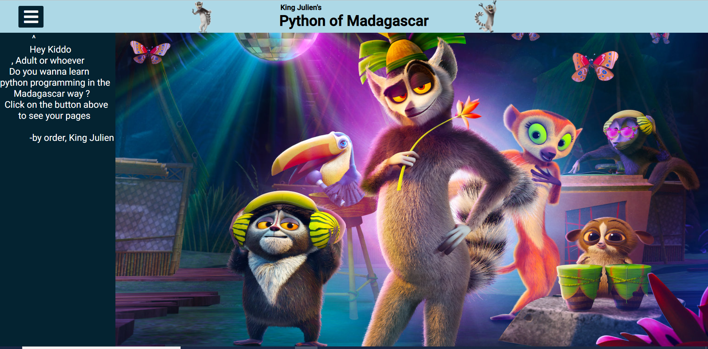
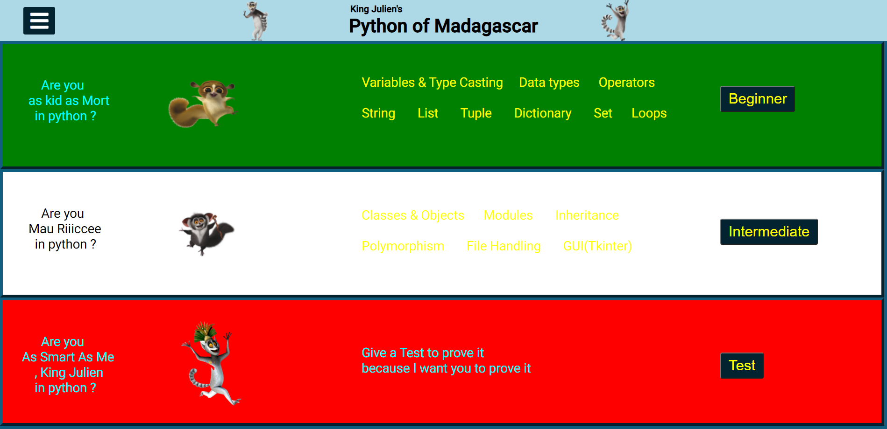
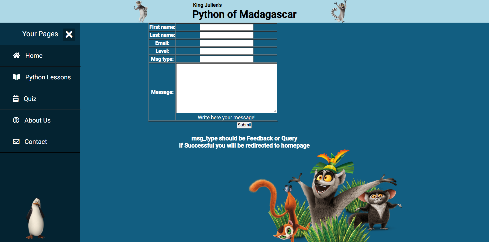

# PythonTutorialWebsite
This is a python tutorial website made by using django for sem 4 python mini project. The main aim of this project was to showcase the various things we learnt during lectures of python in our college

## Notes
First and most important; The rights of the pictures used belong to the people who own them. These pictures are just used for educational purpose only (hence the folder name was exp11pp). Besides we are not hosting this django project 

<a href="https://www.cleanpng.com/png-madagascar-penguins-png-50927/"> kolwos.png</a>
<a href="https://www.cleanpng.com/png-julien-mort-madagascar-lemur-dreamworks-cute-squir-82094/">mort.png</a>
<a href="https://www.cleanpng.com/png-the-all-hail-king-julien-show-madagascar-dreamwork-909668/">kjm.png</a>
<a href="https://www.cleanpng.com/png-julien-lemur-madagascar-film-dreamworks-animation-1219112/">kj3.png</a>
<a href="https://www.cleanpng.com/png-julien-lemurs-mort-madagascar-ring-tailed-lemur-ma-4018067/">kj1.png</a>
<a href="https://www.cleanpng.com/png-julien-madagascar-lemur-youtube-animation-2081942/">kj4.png</a>
<a href="https://www.cleanpng.com/png-julien-lemur-madagascar-animation-character-lilo-782552/">maurice.png</a>
<a href="https://images.app.goo.gl/XrgMYDo3NPcKysUd8">kj2.png</a>

## Requirements
1. A db.sqlite3 is required so follow the steps <a href="https://www.delftstack.com/howto/django/django-reset-database/">mentioned here</a>
2. Download Xampp, create a db after starting apache and mysql and then run the two python codes in create_table folder
3. Convert form.py.txt and qform.py.txt into form.py and qform.py, which are in the app folder, and follow the instructions in them
4. domin is the default username and 123456 is the password , to create another superuser <a href="https://docs.djangoproject.com/en/1.8/intro/tutorial02/">See here</a>

## Features 
* This is a python tutorial website having King Julien of Madagascar as it's gimmick
* We used Python,Django,HTML and CSS
* It was connected to MySQL via Xampp and dblite
* SMTP is used in the form and qform module for the contact and test respectively

## Images

## Drawbacks
1. The Login System is just like an open garden with a door in between for no reason and thus there was no need for it since it's not serving any purpose
2. The UI of this web-app is not mobile compatible as in it's really messy
3. Most pages in beginner's lessons have bootstrap used in them , so the UI is slightly off
4. The test is static i.e It has 5 questions only
5. Low Level of Error Handling
6. No Authentication for the link/API